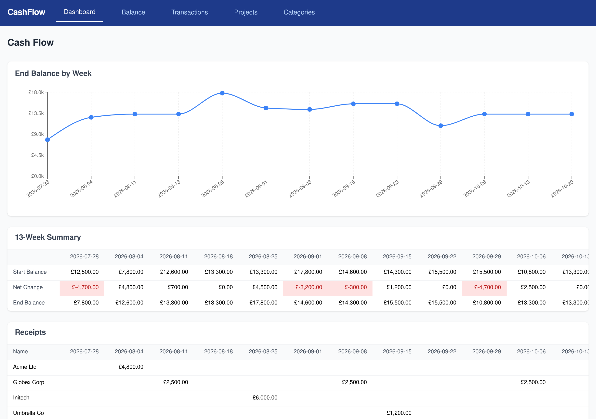

# simple-cash-flow

A lightweight, self-hosted cash flow projection app for a small business. Enter
your upcoming invoices and bills and get a rolling **13-week cash flow
forecast** — so you can see low-balance weeks coming.

It replaces a Supabase + Budibase + Metabase stack with a single, self-hosted
React + Express + PostgreSQL app you run with Docker Compose.



## Features

- **13-week rolling forecast** from your current balance, upcoming income, and
  expenses — with a running end-of-week balance chart that flags negative weeks.
- **Recurring transactions** (monthly) projected forward automatically.
- **Projects and categories** to group income and expenses.
- **Single-user authentication** (can be disabled for a trusted LAN).
- **Multi-arch Docker images** (amd64 + arm64) — runs on a laptop, a server, or
  a Raspberry Pi / ARM NAS.

## Quick start

Requires Docker and Docker Compose. This pulls the prebuilt images from GHCR —
no build step needed.

```bash
# 1. Get the compose file and env template
curl -O https://raw.githubusercontent.com/tmnrtn/simple-cash-flow/main/docker-compose.yml
curl -o .env https://raw.githubusercontent.com/tmnrtn/simple-cash-flow/main/.env.example

# 2. Edit .env — at minimum set POSTGRES_PASSWORD, AUTH_PASSWORD and AUTH_SECRET
#    (to try it with sample data, also set DEMO_DATA=true)

# 3. Start it
docker compose up -d
```

Then open **http://localhost:8080** and sign in with the username/password from
your `.env`.

> `DEMO_DATA=true` only seeds while the database volume is empty, so set it
> before the first start. On an empty install the dashboard prompts you to add
> your current balance to begin forecasting.

By default the images track `latest`. Pin a specific release with `IMAGE_TAG` in
`.env` (e.g. `IMAGE_TAG=1.2.3`).

## Configuration

All configuration is via environment variables, read from `.env` by Docker
Compose. See [`.env.example`](.env.example) for the annotated list.

| Variable | Default | Required | Description |
| --- | --- | --- | --- |
| `POSTGRES_PASSWORD` | — | **yes** | Database password. Compose refuses to start without it. |
| `POSTGRES_USER` | `postgres` | no | Database user. |
| `POSTGRES_DB` | `cashflow` | no | Database name. |
| `AUTH_PASSWORD` | — | yes¹ | Login password (plaintext). |
| `AUTH_PASSWORD_HASH` | — | no | bcrypt hash of the password; takes precedence over `AUTH_PASSWORD`. |
| `AUTH_SECRET` | — | yes¹ | Secret used to sign session cookies (use a long random string). |
| `AUTH_USERNAME` | `admin` | no | Login username. |
| `AUTH_DISABLED` | `false` | no | Set `true` to disable auth entirely (trusted LAN only). |
| `DEMO_DATA` | `false` | no | Seed a fictional demo dataset on first DB boot. |
| `WEB_PORT` | `8080` | no | Host port for the web app. |
| `API_PORT` | `3000` | no | Host port for the API — development only (see below). |
| `IMAGE_TAG` | `latest` | no | Published image tag to run (`latest`, a version like `1.2.3`, or `edge`). |

¹ Required unless `AUTH_DISABLED=true`. The API fails fast with a clear message
if authentication is enabled but unconfigured.

Generate strong secrets:

```bash
openssl rand -hex 24   # POSTGRES_PASSWORD
openssl rand -hex 32   # AUTH_SECRET
```

## How it's served

The **web** container serves the built SPA via nginx and reverse-proxies `/api`
to the **api** container. Only the web port is published to the host; the API
and database are reachable only on the internal Docker network.

Published images:

- `ghcr.io/tmnrtn/simple-cash-flow-api`
- `ghcr.io/tmnrtn/simple-cash-flow-web`

Tags: `latest` (newest release), `1.2.3` / `1.2` (semver), and `edge` (latest
`main`).

## Upgrading

```bash
docker compose pull
docker compose up -d
```

Pinned to a version? Bump `IMAGE_TAG` in `.env` first, then run the above. Your
data lives in the `postgres_data` volume and is untouched by upgrades.

## Backup and restore

Data lives in the `postgres_data` Docker volume. Back it up with `pg_dump`:

```bash
# Backup
docker compose exec -T db pg_dump -U postgres cashflow > backup.sql

# Restore (into a running, empty database)
docker compose exec -T db psql -U postgres cashflow < backup.sql
```

Adjust the user/database if you changed `POSTGRES_USER` / `POSTGRES_DB`.

## Development

Run the full stack from source with hot reloading (Vite dev server + API
`--watch`), with the API also exposed on the host:

```bash
docker compose -f docker-compose.yml -f docker-compose.dev.yml up --build
```

To build and run the production images from source (no pull):

```bash
docker compose -f docker-compose.yml -f docker-compose.build.yml up --build
```

You can also run the services directly on your machine (with the database still
in Docker):

```bash
docker compose up -d db

# API — needs DB_PASSWORD set to match POSTGRES_PASSWORD
cd api && npm install && DB_PASSWORD=... AUTH_DISABLED=true npm run dev

# Web — Vite dev server on :5173, proxies /api to the API
cd web && npm install && npm run dev
```

See [`CONTRIBUTING.md`](CONTRIBUTING.md) for linting, formatting, and tests, and
[`CLAUDE.md`](CLAUDE.md) for a deeper tour of the architecture.

## License

[MIT](LICENSE)
